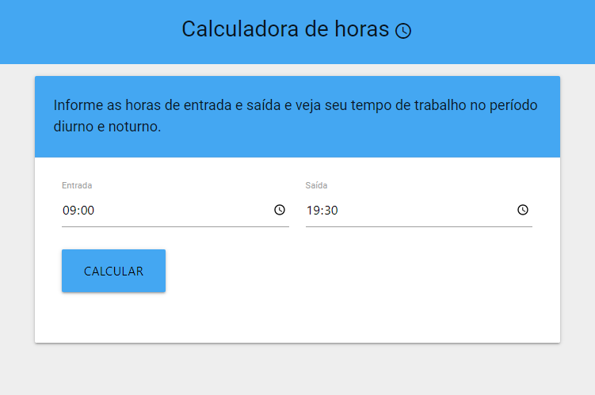

<h1 align="center">
    <b>Calculadora de horas</b> 
</h1>

<p align="center">    
    
    
</p>

## 🔖 Sobre

A legislação trabalhista brasileira prevê a diferenciação de remuneração das horas
trabalhadas em horário noturno, em relação às trabalhadas em horário diurno. Considerando o primeiro válido no período entre as 22:00 e as 05:00 e o segundo o período entre as 05:00 e as 22:00.

Esta app permite o cômputo do tempo trabalhado nos períodos noturno e diurno com base no valor da hora de entrada e saída.

<a id="documentacao"></a>

## 🚀 Tecnologias

O projeto foi desenvolvido utilizando as seguintes tecnologias:

-   [ReactJS](https://reactjs.org/)
-   [NodeJS](https://nodejs.org/)
-   [Materialize](https://materializecss.com/)

## ✔️ Interface

<h1 align="center">
    
</h1>

[Demonstração](https://tsouza-period-calculator.herokuapp.com/)

<a id="como-contribuir"></a>

## 🏠 Execução local

Baixando a aplicação

```bash
$ git clone https://github.com/tsouza21/period-calculator.git
$ cd period-calculator
```

Iniciando o servidor Node

```bash
$ npm i
$ npm start
```

Iniciando a app React

```bash
$ cd frontend
$ npm i
$ npm start
```

## ♻️ Como contribuir

-   Faça um Fork desse repositório,
-   Crie uma branch com a sua feature: `git checkout -b my-feature`
-   Commit suas mudanças: `git commit -m 'My new feature'`
-   Push a sua branch: `git push origin my-feature`
